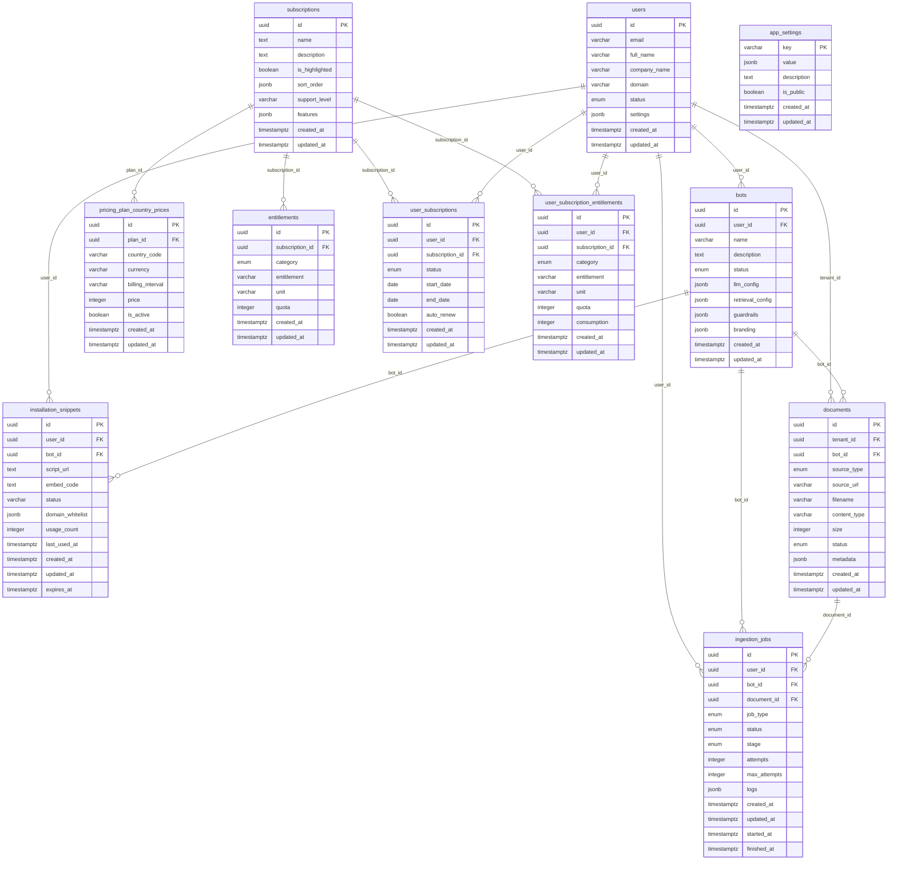

# Database Schema Diagram

[← Docs Index](./README.md) · [Full Schema](./FINAL_SCHEMA.md)

## ER Diagram (Mermaid)

## Notes
- **Global tables (admin-only):** `subscriptions`, `pricing_plan_country_prices`, `entitlements`, `app_settings`.
- **Tenant data:** `users` (tenants), `bots`, `documents`, `installation_snippets`, `user_subscriptions`, `user_subscription_entitlements`, `ingestion_jobs`.
- **Cascade deletes:** FKs are configured with `ON DELETE CASCADE` in the models for dependent rows.
- **Enums:** 
  - `user_status` - used by `users.status` (active, pending_verification, suspended)
  - `bot_status` - used by `bots.status` (draft, active, paused, archived)
  - `document_source_type` - used by `documents.source_type` (file, url, integration)
  - `document_status` - used by `documents.status` (pending, processing, indexed, error)
  - `entitlement_category` - used by `entitlements.category` (file, chat, other)
  - `user_subscription_status` - used by `user_subscriptions.status` (active, expired, cancelled)
  - `ingestion_job_type` - used by `ingestion_jobs.job_type` (ingest_upload, ingest_url, reindex_document, delete_document_vectors_reindex_bot)
  - `ingestion_job_status` - used by `ingestion_jobs.status` (queued, processing, succeeded, failed, cancelled)
  - `ingestion_job_stage` - used by `ingestion_jobs.stage` (download, parse, chunk, embed, index)
- **Computed Properties**: Some models provide computed properties (not database columns):
  - `User.is_verified` - computed from `users.status` (returns `True` if status == 'active')
  - `Bot.is_active` - computed from `bots.status` (returns `True` if status == 'active')
  - `InstallationSnippet.is_active` - computed from `installation_snippets.status` (returns `True` if status == 'active')
  - `UserSubscription.is_active` - computed from `user_subscriptions.status` (returns `True` if status == 'active')
  - `UserSubscription.is_expired` - computed from `user_subscriptions.end_date` (returns `True` if end_date < today())
  - `UserSubscriptionEntitlement.balance` - computed from `user_subscription_entitlements.quota - consumption`
  - `UserSubscriptionEntitlement.is_exceeded` - computed from `user_subscription_entitlements.consumption > quota`
  - `UserSubscriptionEntitlement.usage_percentage` - computed from `user_subscription_entitlements.consumption / quota * 100`
  - `IngestionJob.is_completed` - computed from `ingestion_jobs.status` (returns `True` if status is succeeded, failed, or cancelled)
  - `IngestionJob.is_active` - computed from `ingestion_jobs.status` (returns `True` if status is queued or processing)
  - `IngestionJob.can_retry` - computed from `ingestion_jobs.status`, `attempts`, and `max_attempts` (returns `True` if failed and attempts < max_attempts)
  - `IngestionJob.duration_seconds` - computed from `ingestion_jobs.started_at` and `finished_at` (returns duration in seconds)
- For full column details and SQL, see `FINAL_SCHEMA.md` and `DATABASE_SCHEMA.md`.

