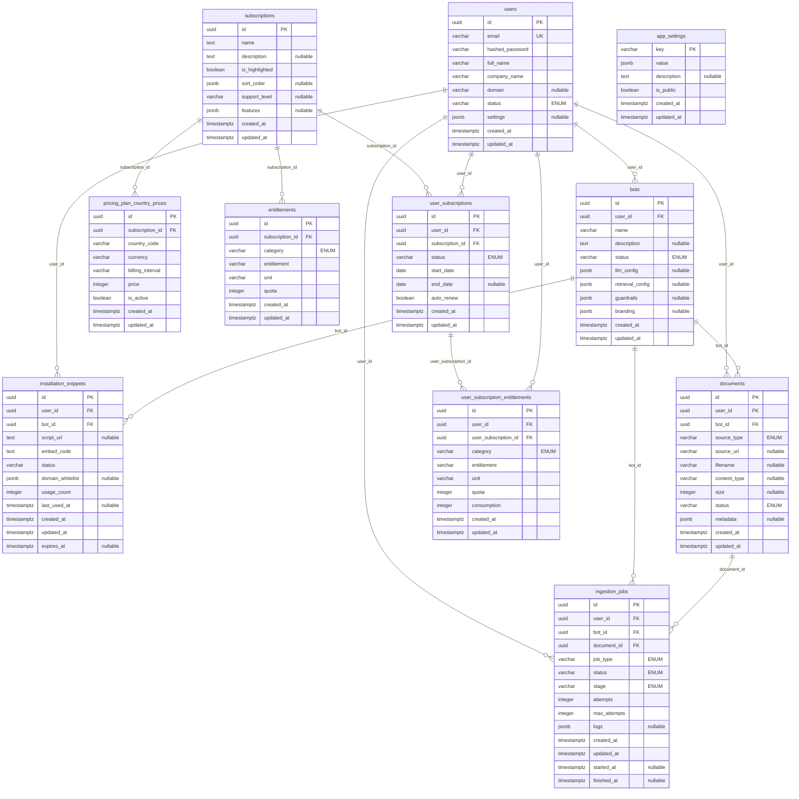

# Database Schema Diagram

[← Docs Index](./README.md) · [Full Schema](./FINAL_SCHEMA.md)

## ER Diagram (Mermaid)



## Legend

- **PK** = Primary Key
- **FK** = Foreign Key (with CASCADE DELETE)
- **UK** = Unique Key/Constraint
- **"ENUM"** = Fields marked with "ENUM" are database ENUM types (not VARCHAR). See Enum Details section below for all possible values.
- **"nullable"** = Fields marked with "nullable" can be NULL in the database
- **varchar** = Variable-length string
- **jsonb** = JSON Binary (PostgreSQL JSON type)
- **timestamptz** = Timestamp with timezone
- **integer** = Integer number
- **boolean** = Boolean (true/false)
- **date** = Date (without time)
- **text** = Text (unlimited length)
- **uuid** = UUID (Universally Unique Identifier)

**Note:** Mermaid ER diagrams do not natively support ENUM types, so enum fields are shown as `varchar` with `"ENUM"` annotation to indicate they are actually database ENUM types.

**Note:** Mermaid ER diagrams only support one annotation per field. Therefore:
- Fields with constraint annotations (`PK`, `FK`, `UK`) show only the constraint type
- Nullable fields without constraints are marked with `"nullable"`
- The `document_id` foreign key in `ingestion_jobs` is nullable (not shown in diagram) because bot-level jobs don't reference a specific document
- The `stage` field in `ingestion_jobs` is nullable (not shown in diagram) - it's NULL when job is queued or not yet started
- See the Notes section below and detailed schema docs for complete constraint and nullable field information

**Note:** This diagram shows the basic structure. For detailed information including:
- Enum values and their options (see Enum Details section below)
- Column constraints (NOT NULL, NULLABLE, DEFAULT values)
- Indexes
- Complete column descriptions

Please refer to the **Enum Details** section below and the full schema documentation in `FINAL_SCHEMA.md` and `DATABASE_SCHEMA.md`.

## Notes
- **Global tables (admin-only):** `subscriptions`, `pricing_plan_country_prices`, `entitlements`, `app_settings`.
- **Tenant data:** `users` (tenants), `bots`, `documents`, `installation_snippets`, `user_subscriptions`, `user_subscription_entitlements`, `ingestion_jobs`.
- **Cascade deletes:** All foreign keys are configured with `ON DELETE CASCADE` in the models for dependent rows.
- **Unique constraints:**
  - `installation_snippets.bot_id` - One snippet per bot (enforced by UNIQUE constraint)
  - `entitlements(subscription_id, category, entitlement)` - One entitlement definition per subscription/category/entitlement combination
  - `user_subscription_entitlements(user_subscription_id, category, entitlement)` - One entitlement record per user subscription/category/entitlement combination
  - `pricing_plan_country_prices(subscription_id, country_code, billing_interval)` - One price per subscription/country/billing interval combination
- **Check constraints:**
  - `user_subscription_entitlements.consumption >= 0` - Ensures consumption is non-negative
  - `user_subscription_entitlements.quota >= 0` - Ensures quota is non-negative
  - `pricing_plan_country_prices.price > 0` - Ensures price is positive
- **Exclusion constraint:**
  - `user_subscriptions` - Prevents overlapping date ranges for active subscriptions per user (ensures only one active subscription per user at any given time)
- **Database triggers:**
  - `user_subscription_entitlements` - Validates that `user_id` matches the `user_id` of the referenced `user_subscription` before INSERT or UPDATE
- **Nullable fields:**
  - `ingestion_jobs.document_id` - Nullable because bot-level jobs (e.g., `delete_document_vectors_reindex_bot`) don't reference a specific document
  - `ingestion_jobs.stage` - Nullable when job is queued or not yet started

## Enum Details

### `users.status` (ENUM: user_status)
- **`active`** - User/tenant account is active and verified (can log in)
- **`pending_verification`** - Account created but email not verified (default, cannot log in)
- **`suspended`** - Account suspended (cannot log in)

### `bots.status` (ENUM: bot_status)
- **`draft`** - Bot is being created/configured (default)
- **`active`** - Bot is live and operational
- **`paused`** - Bot is temporarily disabled
- **`archived`** - Bot is deactivated/removed

### `documents.source_type` (ENUM: document_source_type)
- **`file`** - Uploaded file stored in MinIO (default)
- **`url`** - External URL to crawl and process
- **`integration`** - 3rd-party integration (e.g., Notion, Google Drive)

### `documents.status` (ENUM: document_status)
- **`pending`** - Document uploaded, waiting for text extraction (default)
- **`processing`** - Text extraction completed, ready for next pipeline stage
- **`uploaded_to_database`** - Reserved for future use
- **`error`** - Text extraction failed permanently (after max retry attempts)

### `installation_snippets.status` (VARCHAR)
- **`active`** - Snippet is active and can be used (default)
- **`revoked`** - Snippet has been revoked and cannot be used

### `entitlements.category` (ENUM: entitlement_category)
- **`file`** - File-related entitlements (storage, file_count)
- **`chat`** - Chat/token entitlements (tokens, API calls)
- **`other`** - Miscellaneous entitlements

### `user_subscription_entitlements.category` (ENUM: entitlement_category)
- **`file`** - File-related entitlements (storage, file_count)
- **`chat`** - Chat/token entitlements (tokens, API calls)
- **`other`** - Miscellaneous entitlements

### `user_subscriptions.status` (ENUM: user_subscription_status)
- **`active`** - Subscription is active (default)
- **`expired`** - Subscription has expired (end_date passed)
- **`cancelled`** - Subscription was manually cancelled

### `pricing_plan_country_prices.billing_interval` (VARCHAR)
- **`monthly`** - Monthly billing cycle
- **`yearly`** - Yearly billing cycle

### `ingestion_jobs.job_type` (ENUM: ingestion_job_type)
- **`ingest_upload`** - Process an uploaded file
- **`ingest_url`** - Crawl and process a URL
- **`reindex_document`** - Re-index an existing document
- **`delete_document_vectors_reindex_bot`** - Delete all document vectors and re-index entire bot

### `ingestion_jobs.status` (ENUM: ingestion_job_status)
- **`queued`** - Job is queued for processing (default)
- **`processing`** - Job is currently being processed
- **`succeeded`** - Job completed successfully
- **`failed`** - Job failed with an error
- **`cancelled`** - Job was manually cancelled

### `ingestion_jobs.stage` (ENUM: ingestion_job_stage)
- **`download`** - Downloading content from URL
- **`parse`** - Parsing document content
- **`chunk`** - Chunking text into smaller pieces
- **`embed`** - Generating embeddings for chunks
- **`index`** - Indexing vectors in the vector database
- **Computed Properties**: Some models provide computed properties (not database columns):
  - `User.is_verified` - computed from `users.status` (returns `True` if status == 'active')
  - `Bot.is_active` - computed from `bots.status` (returns `True` if status == 'active')
  - `InstallationSnippet.is_active` - computed from `installation_snippets.status` (returns `True` if status == 'active')
  - `UserSubscription.is_active` - computed from `user_subscriptions.status` (returns `True` if status == 'active')
  - `UserSubscription.is_expired` - computed from `user_subscriptions.end_date` (returns `True` if end_date < today())
  - `UserSubscriptionEntitlement.balance` - computed from `user_subscription_entitlements.quota - consumption`
  - `UserSubscriptionEntitlement.is_exceeded` - computed from `user_subscription_entitlements.consumption > quota`
  - `UserSubscriptionEntitlement.usage_percentage` - computed from `user_subscription_entitlements.consumption / quota * 100`
  - `IngestionJob.is_completed` - computed from `ingestion_jobs.status` (returns `True` if status is succeeded, failed, or cancelled)
  - `IngestionJob.is_active` - computed from `ingestion_jobs.status` (returns `True` if status is queued or processing)
  - `IngestionJob.can_retry` - computed from `ingestion_jobs.status`, `attempts`, and `max_attempts` (returns `True` if failed and attempts < max_attempts)
  - `IngestionJob.duration_seconds` - computed from `ingestion_jobs.started_at` and `finished_at` (returns duration in seconds)

## JSONB Field Structures

### `bots.llm_config` Structure
```json
{
  "model": "qwen3-vl:8b",
  "temperature": 0.7,
  "top_p": 0.9,
  "max_tokens": 1000,
  "communication_style": "friendly",
  "style_prompt": "You are a friendly and warm assistant..."
}
```

**Default Values** (set automatically when creating a draft bot or new bot):
- `model`: `"qwen3-vl:8b"` (from `settings.OLLAMA_LLM_MODEL`)
- `temperature`: `0.7`

### `bots.retrieval_config` Structure
```json
{
  "embedding_model": "qwen3-embedding:4b",
  "chunk_size": 1000,
  "chunk_overlap": 200,
  "vector_db": {
    "provider": "qdrant",
    "collection_name": "bot_{bot_id}"
  },
  "filters": {},
  "rag_params": {
    "top_k": 5,
    "similarity_threshold": 0.7
  }
}
```

**Default Values** (set automatically when creating a draft bot or new bot):
- `embedding_model`: `"qwen3-embedding:4b"` (from `settings.OLLAMA_EMBEDDING_MODEL`)
- `chunk_size`: `1000` (characters)
- `chunk_overlap`: `200` (characters)

These defaults are applied in `BotService.create_draft_bot()` and `BotService.create_bot()` if not provided.

### `bots.guardrails` Structure
```json
{
  "max_response_length": 500,
  "blocked_phrases": ["refund immediately", "cancel now"],
  "block_explicit_content": true,
  "block_political_views": true,
  "strictly_stick_to_topic": true,
  "block_personal_info": true,
  "enable_fact_checking": true,
  "custom_instructions": "Always be helpful and professional..."
}
```

### `bots.branding` Structure
```json
{
  "logo_url": "https://example.com/logo.png",
  "avatar_url": "https://example.com/avatar.png",
  "primary_color": "#6366f1",
  "background_color": "#ffffff",
  "welcome_message": "Hello! How can I help?",
  "intro_message": "Hello! How can I help you today?",
  "assistant_name": "Assistant",
  "chat_title": "Assistant",
  "position": "bottom-right",
  "height": 600,
  "width": 400
}
```

- For full column details and SQL, see `FINAL_SCHEMA.md` and `DATABASE_SCHEMA.md`.

