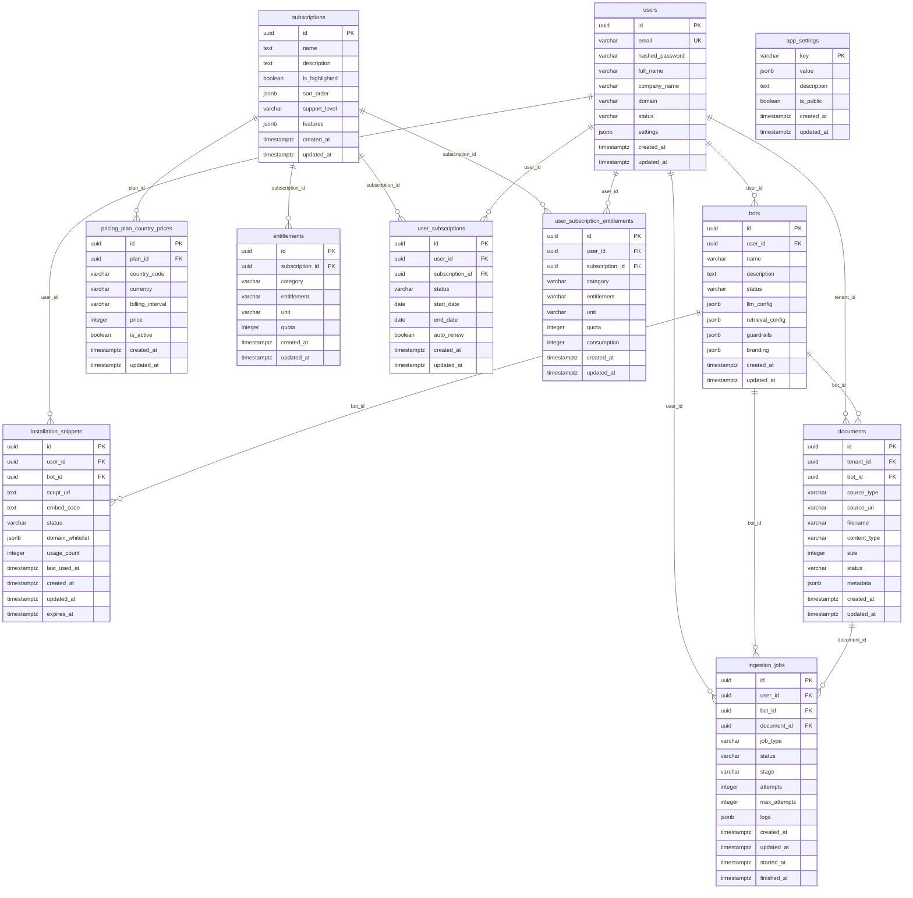

# Database Schema Diagram

[← Docs Index](./README.md) · [Full Schema](./FINAL_SCHEMA.md)

## ER Diagram (Mermaid)

## Legend

- **PK** = Primary Key
- **FK** = Foreign Key (with CASCADE DELETE)
- **UK** = Unique Key/Constraint

**Note:** This diagram shows the basic structure. For detailed information including:
- Enum values and their options
- Column constraints (NOT NULL, NULLABLE, DEFAULT values)
- Indexes
- Complete column descriptions

Please refer to the **Enum Details** section below and the full schema documentation in `FINAL_SCHEMA.md` and `DATABASE_SCHEMA.md`.

## Notes
- **Global tables (admin-only):** `subscriptions`, `pricing_plan_country_prices`, `entitlements`, `app_settings`.
- **Tenant data:** `users` (tenants), `bots`, `documents`, `installation_snippets`, `user_subscriptions`, `user_subscription_entitlements`, `ingestion_jobs`.
- **Cascade deletes:** All foreign keys are configured with `ON DELETE CASCADE` in the models for dependent rows.

## Enum Details

### `users.status` (ENUM: user_status)
- **`active`** - User/tenant account is active and verified (can log in)
- **`pending_verification`** - Account created but email not verified (default, cannot log in)
- **`suspended`** - Account suspended (cannot log in)

### `bots.status` (ENUM: bot_status)
- **`draft`** - Bot is being created/configured (default)
- **`active`** - Bot is live and operational
- **`paused`** - Bot is temporarily disabled
- **`archived`** - Bot is deactivated/removed

### `documents.source_type` (ENUM: document_source_type)
- **`file`** - Uploaded file stored in MinIO (default)
- **`url`** - External URL to crawl and process
- **`integration`** - 3rd-party integration (e.g., Notion, Google Drive)

### `documents.status` (ENUM: document_status)
- **`pending`** - Document uploaded, waiting for processing (default)
- **`processing`** - Currently being indexed/processed
- **`indexed`** - Successfully indexed and ready for use
- **`error`** - Processing failed

### `installation_snippets.status` (VARCHAR)
- **`active`** - Snippet is active and can be used (default)
- **`revoked`** - Snippet has been revoked and cannot be used

### `entitlements.category` (ENUM: entitlement_category)
- **`file`** - File-related entitlements (storage, file_count)
- **`chat`** - Chat/token entitlements (tokens, API calls)
- **`other`** - Miscellaneous entitlements

### `user_subscriptions.status` (ENUM: user_subscription_status)
- **`active`** - Subscription is active (default)
- **`expired`** - Subscription has expired (end_date passed)
- **`cancelled`** - Subscription was manually cancelled

### `pricing_plan_country_prices.billing_interval` (VARCHAR)
- **`monthly`** - Monthly billing cycle
- **`yearly`** - Yearly billing cycle

### `ingestion_jobs.job_type` (ENUM: ingestion_job_type)
- **`ingest_upload`** - Process an uploaded file
- **`ingest_url`** - Crawl and process a URL
- **`reindex_document`** - Re-index an existing document
- **`delete_document_vectors_reindex_bot`** - Delete all document vectors and re-index entire bot

### `ingestion_jobs.status` (ENUM: ingestion_job_status)
- **`queued`** - Job is queued for processing (default)
- **`processing`** - Job is currently being processed
- **`succeeded`** - Job completed successfully
- **`failed`** - Job failed with an error
- **`cancelled`** - Job was manually cancelled

### `ingestion_jobs.stage` (ENUM: ingestion_job_stage)
- **`download`** - Downloading content from URL
- **`parse`** - Parsing document content
- **`chunk`** - Chunking text into smaller pieces
- **`embed`** - Generating embeddings for chunks
- **`index`** - Indexing vectors in the vector database
- **Computed Properties**: Some models provide computed properties (not database columns):
  - `User.is_verified` - computed from `users.status` (returns `True` if status == 'active')
  - `Bot.is_active` - computed from `bots.status` (returns `True` if status == 'active')
  - `InstallationSnippet.is_active` - computed from `installation_snippets.status` (returns `True` if status == 'active')
  - `UserSubscription.is_active` - computed from `user_subscriptions.status` (returns `True` if status == 'active')
  - `UserSubscription.is_expired` - computed from `user_subscriptions.end_date` (returns `True` if end_date < today())
  - `UserSubscriptionEntitlement.balance` - computed from `user_subscription_entitlements.quota - consumption`
  - `UserSubscriptionEntitlement.is_exceeded` - computed from `user_subscription_entitlements.consumption > quota`
  - `UserSubscriptionEntitlement.usage_percentage` - computed from `user_subscription_entitlements.consumption / quota * 100`
  - `IngestionJob.is_completed` - computed from `ingestion_jobs.status` (returns `True` if status is succeeded, failed, or cancelled)
  - `IngestionJob.is_active` - computed from `ingestion_jobs.status` (returns `True` if status is queued or processing)
  - `IngestionJob.can_retry` - computed from `ingestion_jobs.status`, `attempts`, and `max_attempts` (returns `True` if failed and attempts < max_attempts)
  - `IngestionJob.duration_seconds` - computed from `ingestion_jobs.started_at` and `finished_at` (returns duration in seconds)
- For full column details and SQL, see `FINAL_SCHEMA.md` and `DATABASE_SCHEMA.md`.

