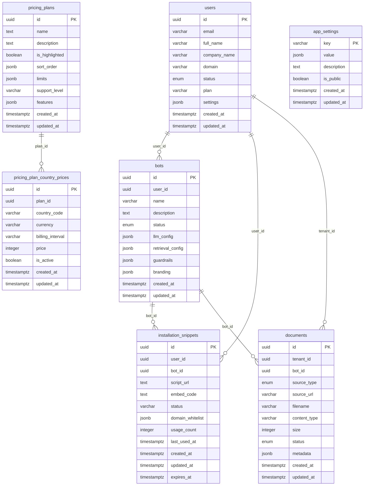

# Database Schema Diagram

[← Docs Index](./README.md) · [Full Schema](./FINAL_SCHEMA.md)

## ER Diagram (Mermaid)

## Notes
- **Global tables (admin-only):** `pricing_plans`, `pricing_plan_country_prices`, `app_settings`.
- **Tenant data:** `users` (tenants), `bots`, `documents`, `installation_snippets`.
- **Cascade deletes:** FKs are configured with `ON DELETE CASCADE` in the models for dependent rows.
- **Status enums:** `users.status`, `bots.status`, `documents.status` use enums as defined in the models.
- For full column details and SQL, see `FINAL_SCHEMA.md` and `DATABASE_SCHEMA.md`.

git 